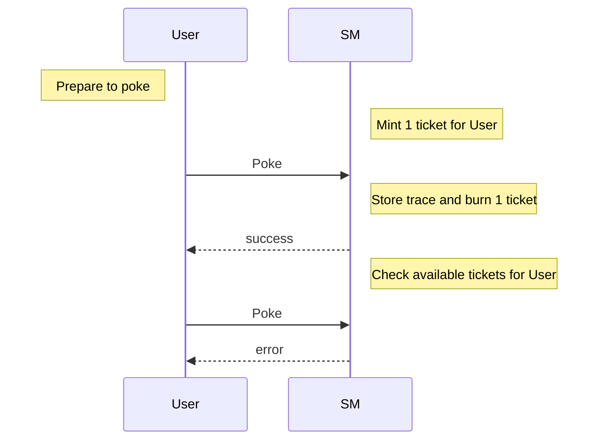
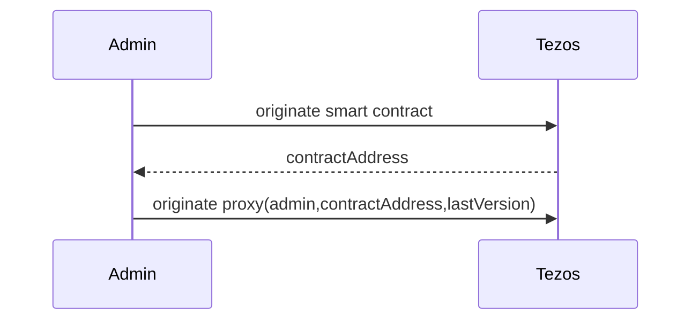
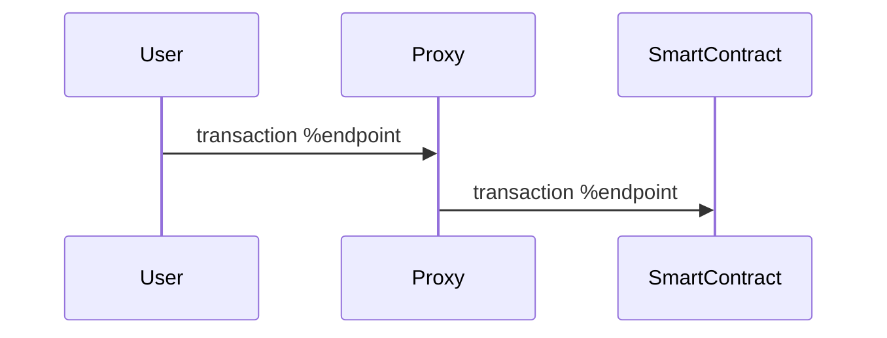

Training dapp n°3
===

# :point_up:  Poke game (reloaded)

Previouly, you learned how to do inter-contract calls, use view and do unit testing.
In this third session, you will enhance your skills on :
- using tickets
- upgrading a smart contract and store function code
- using the Global table of Constant

On the second version of the poke game, you were able poke any contract without constraint. We will introduce now a right to poke via tickets. Ticket are a kind of object that cannot be copied and can hold some trustable information.

As you maybe know, smart contracts are immutable but in real life, applications are not and evolve. Let's see 2 tricks that allow to upgrade a contract

Finally we introduce the Global table of Constant, a way to store more efficiently static data (https://www.marigold.dev/post/introducing-global-constants)

## new Poke sequence diagram



# :memo: Prerequisites

There is nothing more than you needed on first session : https://github.com/marigold-dev/training-dapp-1#memo-prerequisites

Get your code from the session 2 or the solution [here](https://github.com/marigold-dev/training-dapp-1/tree/main/solution)

# :ticket: Tickets

Tickets just came with Tezos Edo upgrade, they are great and often misundersood

Ticket structure :
- ticketer : (address) the contract address of the creator
- value : (any) Can be any type from string to bytes
- amount : (nat) quantity of tickets minted

Tickets features :
- Not comparable : it makes no sense
- Transferable : you can send ticket as Transaction parameter
- Storable : only on smart contract storage for the moment
- Non dupable : you cannot copy or duplicate a ticket, it is a unique singleton object living in the network
- Splittable : if amount is > 2 then you can split ticket object into 2 objects
- Mergable : you can merge ticket from same ticketer and same value
- Mintable/burnable : this is the way to create and destroy tickets

Example of usage :
- AUTHN/AUTHZ token : give a ticket to a user from a allowed ticketer gives you AUTHN, add some claims on the ticket value and it gives you AUTHZ
- Simplified FA1.2/FA2 token : you can represent crypto token with tickets (mint/burn/split/join)
- Voting rights : give 1 ticket that count for 1 vote on each member
- Wrapped crypto : hold XTZ colletral agains a ticket for redeeming it
- many others ...

## Step 1 : Mint

Edit the ./smartcontract/pokeGame.jsligo file and add a map of ticket ownership

```javascript
type storage = {
    pokeTraces : map<address, pokeMessage>,
    feedback : string,
    ticketOwnership : map<address,ticket>
};
```

## Step 2 : Check ticket while poking

Add a check to allow only users that have a valid ticket, if it is the case burn 1 ticket otherwise return an error

```javascript

```

## Step 3 : Play !

Let play with the CLI

```bash
ligo compile contract ./smartcontract/pokeGame.jsligo --output-file pokeGame.tz
```

Compile an initial storage (to pass later during deployment too)

```bash
ligo compile storage ./smartcontract/pokeGame.jsligo 'Set.empty as set<address>' --output-file pokeGameStorage.tz --entry-point main
```


> Ligo unit tests do not support tickets for the moment (https://gitlab.com/ligolang/ligo/-/issues/1402)

# :arrows_clockwise: Upgrades

As everyone knows, one feature of blockchain is to keep immutable code on a block. This allows transparency, traceability and trustlessness.

But application lifecycle implies to evolve and upgrade code to fix bug or bring functionalities. So how can we do it ?

## Naive approach

Ones can deploy a new version of the smart contract and do a redirection to the new address on front end side 

| Pros | Cons |
| --   |   -- |
| Easy to do | Old contract remains active, so do bugs |
|  | Need to migrate old storage, cost money |

## Stored Lambda function


## Proxy pattern

Goal is to have a proxy contract that maintain the application lifecycle

Init



Interaction




# :minidisc: Global table of Constant

# :palm_tree: Conclusion :sun_with_face:

Now, you are able to understand ticket , upgrade deployed contracts

On next training, //TODO

[:arrow_right: NEXT](https://github.com/marigold-dev/training-dapp-4)