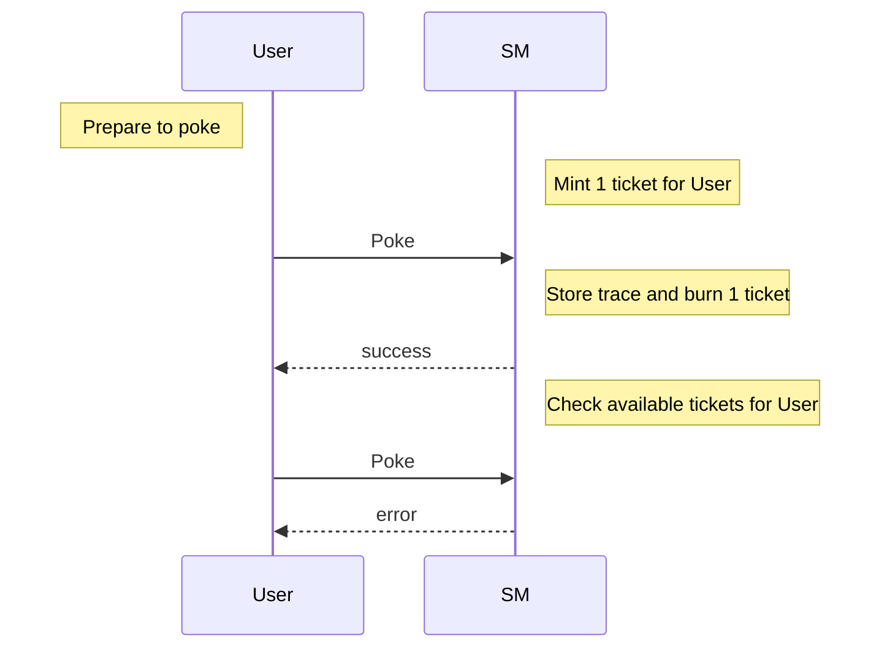

Training dapp n°3
===

# :point_up:  Poke game with permissions

Previously, you learned how to do inter-contract calls, use view and do unit testing.
In this third session, you will enhance your skills on :
- using tickets
- don't mess up with tickets

On the second version of the poke game, you were able poke any contract without constraint. We will introduce now a right to poke via tickets. Ticket are a kind of object that cannot be copied and can hold some trustable information.

## new Poke sequence diagram



# :memo: Prerequisites

There is nothing more than you needed on first session : https://github.com/marigold-dev/training-dapp-1#memo-prerequisites

Get your code from the session 2 or the solution [here](https://github.com/marigold-dev/training-dapp-2/tree/main/solution)

# :ticket: Tickets

Tickets just came with Tezos Edo upgrade, they are great and often misundersood

Ticket structure :
- ticketer : (address) the contract address of the creator
- value : (any) Can be any type from string to bytes
- amount : (nat) quantity of tickets minted

Tickets features :
- Not comparable : it makes no sense
- Transferable : you can send ticket as Transaction parameter
- Storable : only on smart contract storage for the moment
- Non dupable : you cannot copy or duplicate a ticket, it is a unique singleton object living in the network
- Splittable : if amount is > 2 then you can split ticket object into 2 objects
- Mergable : you can merge ticket from same ticketer and same value
- Mintable/burnable : this is the way to create and destroy tickets

Example of usage :
- AUTHN/AUTHZ token : give a ticket to a user from a allowed ticketer gives you AUTHN, add some claims on the ticket value and it gives you AUTHZ
- Simplified FA1.2/FA2 token : you can represent crypto token with tickets (mint/burn/split/join)
- Voting rights : give 1 ticket that count for 1 vote on each member
- Wrapped crypto : hold XTZ colletral agains a ticket for redeeming it
- many others ...

## Step 1 : Mint

Minting is the action of creating ticket from void. In general, minting operations are done by administrators of smart contract or either by end user (while creating an NFT for example)

Edit the ./smartcontract/pokeGame.jsligo file and add a map of ticket ownership to the default `storage` type.
This map will keep a list of consumable ticket for each authrozized user. It will be used as a burnable right to poke here 

```javascript
type storage = {
    pokeTraces : map<address, pokeMessage>,
    feedback : string,
    ticketOwnership : map<address,ticket>
};
```

In order to fill this map, we are adding an new administration endpoint. Modify the `parameter` type, update the `main` function and add the new function `init`


A new entrypoint `Init` will add x tickets to a sepcific user 

> Note : to simplify, we don't add security around this entrypoint, but in Production we should do it

```javascript
export type parameter =
| ["Poke"]
| ["PokeAndGetFeedback", address]
| ["Init", address, nat]
;
```

Main function will add this new entrypoint too.

Tickets are very special objects that cannot be **DUPLICATED**. During compilation to Michelson, using a variable twice, copying a structure holding tickets are genrating `DUP` command. To avoid our contract to fail at runtime, Ligo will parse statically our code during compilation to detect any DUP on tickets.

To solve most of issues, we need to segregate ticket objects, or structures containing ticket objects in order to avoid compilation errors. To do this, just destructure any object until you get tickets isolated on a variable.

Here below, `store` object is destructured to isolate `ticketOwnership` object holding our tickets. You need then to modify the function arguments to pass each field of the the storage separately

```javascript
export const main = ([action, store] : [parameter, storage]) : return_ => {
    //destructure the storage to avoid DUP
    let {pokeTraces  , feedback  , ticketOwnership } = store;
    return match (action, {
        Poke: () => poke([pokeTraces  , feedback  , ticketOwnership]) ,
        PokeAndGetFeedback: (other : address) => pokeAndGetFeedback([other,pokeTraces  , feedback  , ticketOwnership]),
        Init: (initParam : [address, nat]) => init([initParam[0], initParam[1], pokeTraces  , feedback  , ticketOwnership])
      } 
    )
};
```

Add the new `Init` function

```javascript
const init = ([a, ticketCount, pokeTraces  , feedback  , ticketOwnership] : [address, nat, map<address, pokeMessage>  , string  , map<address,ticket<string>>]) : return_ => {
    if(ticketCount == (0 as nat)){
        return [  list([]) as list<operation>,{
            feedback,
            pokeTraces,
            ticketOwnership 
            }];
    } else {
        return [  list([]) as list<operation>,{
            feedback,
            pokeTraces,
            ticketOwnership : Map.add(a,Tezos.create_ticket("can_poke", ticketCount),ticketOwnership) 
            }];
    }
};
```

Init function looks at how many ticket to create from the current caller, then it is added to the current map

Let's modify poke functions now

```javascript
const poke = ([pokeTraces  , feedback  , ticketOwnership] : [map<address, pokeMessage>  , string  , map<address,ticket<string>>]) : return_ => {
    
    //extract opt ticket from map
    const [t , tom] : [option<ticket<string>>, map<address,ticket<string>>]  = Map.get_and_update(Tezos.get_source(), None() as option<ticket<string>>,ticketOwnership);
    
    return match(t, {
        None : () => failwith("User does not have tickets => not allowed"),
        Some : (_t : ticket<string>) => [  list([]) as list<operation>,{ //let t burn
        feedback,
        pokeTraces : Map.add(Tezos.get_source(), {receiver : Tezos.get_self_address(), feedback : ""},pokeTraces),
        ticketOwnership : tom 
     }]
    });
};
```
First, we need to extract an existing optional ticket from the map. If we try to do operation directly on the map, even trying to find or get this object in the structure, a DUP command can be generated. We use the secure `get_and_update` function from Map library to extract the item from the map and avoid any copy.

Second step, we can look at the optional ticket, if it exists, then we burn it (i.e we do not store it somewhere on the storage anymore) and a a trace of execution, otherwise we fail with an error message

Same for `pokeAndGetFeedback` function, do same operations as below 

```javascript
// @no_mutation
const pokeAndGetFeedback = ([oracleAddress,pokeTraces  , _feedback  , ticketOwnership]:[address,map<address, pokeMessage>  , string  , map<address,ticket<string>>]) : return_ => {
  
  //extract opt ticket from map
  const [t , tom] : [option<ticket<string>>, map<address,ticket<string>>]  = Map.get_and_update(Tezos.get_source(), None() as option<ticket<string>>,ticketOwnership);
    
  //Read the feedback view
  let feedbackOpt : option<string> = Tezos.call_view("feedback", unit, oracleAddress);

  return match(t, {
        None : () => failwith("User does not have tickets => not allowed"),
        Some : (_t : ticket<string>) =>

  match( feedbackOpt , {
    Some : (feedback : string) => {
        let feedbackMessage = {receiver : oracleAddress ,feedback: feedback};
        return [  list([]) as list<operation>, { 
          feedback,
          pokeTraces : Map.add(Tezos.get_source(),feedbackMessage , pokeTraces),
          ticketOwnership : tom 
          }]; 
        }, 
    None : () => failwith("Cannot find view feedback on given oracle address")
  })});
};
```

Compile the contract to check any errors

```bash
ligo compile contract ./smartcontract/pokeGame.jsligo 
```

## Step 2 : Test authorization poking

Update the unit tests files to see if we can still poke

```javascript =
#import "./pokeGame.jsligo" "PokeGame"

export type main_fn = (parameter : PokeGame.parameter, storage : PokeGame.storage) => PokeGame.return_ ;

// reset state
const _ = Test.reset_state ( 2 as nat, list([]) as list <tez> );
const faucet = Test.nth_bootstrap_account(0);
const sender1 : address = Test.nth_bootstrap_account(1);
const _ = Test.log("Sender 1 has balance : ");
const _ = Test.log(Test.get_balance(sender1));

const _ = Test.set_baker(faucet);
const _ = Test.set_source(faucet);

//functions
export const _testPoke = ([main , s, ticketCount] : [main_fn , address, nat]) : bool => {

    //contract origination
    const [taddr, _, _] = Test.originate(main, {
        pokeTraces : Map.empty as map<address, PokeGame.pokeMessage> , 
        feedback : "kiss" , 
        ticketOwnership : Map.empty as map<address,ticket<string>>},
        0 as tez);
    const contr = Test.to_contract(taddr);
    const contrAddress = Tezos.address(contr);
    const _ = Test.log("contract deployed with values : ");
    const _ = Test.log(contr);

    const statusInit = Test.transfer_to_contract(contr, Init([sender1,ticketCount]), 0 as tez);
    const _ = Test.log(statusInit);
    const _ = Test.log("*** Check initial ticket is here ***");
    const _ = Test.log(Test.get_storage(taddr));

    Test.set_source(s);

    const status = Test.transfer_to_contract(contr, Poke() as PokeGame.parameter, 0 as tez);
    Test.log(status);

    return match(status,{
        Fail : (_tee : test_exec_error) => false,
        Success : (_n : nat) => match(Map.find_opt (s, (Test.get_storage(taddr) as PokeGame.storage).pokeTraces), {
                                Some: (pokeMessage: PokeGame.pokeMessage) => { assert_with_error(pokeMessage.feedback == "","feedback "+pokeMessage.feedback+" is not equal to expected "+"(empty)"); assert_with_error(pokeMessage.receiver == contrAddress,"receiver is not equal"); return true; } ,
                                None: () => false
       })
    });
      
  };
  
 
  //********** TESTS *************/

  const _ = Test.log("*** Run test to pass ***"); 
  const testSender1Poke = _testPoke([PokeGame.main,sender1, 1 as nat]);

  const _ = Test.log("*** Run test to fail ***"); 
  const testSender1PokeWithNoTicketsToFail = ! _testPoke([PokeGame.main,sender1, 0 as nat]) ;
```

On line 29, we initialize the smartcontract with some tickets
On line 40, we check if we have an error on the test (i.e user is ot allowed to poke)
On line 53, we test with the first user using a preexisting ticket
On line 56, we test with the same user again but with no ticket and we should have a catched error 

Run the test, and look at the logs to track execution

```bash
ligo run test unit_pokeGame.jsligo
```

First test should be fine
```logs
"*** Run test to pass ***"
"contract deployed with values : "
KT1JVH7KyY4RVWgLRdX43WJojBRzMABN8eJu(None)
Success (2674n)
"*** Check initial ticket is here ***"
{feedback = "kiss" ; pokeTraces = [] ; ticketOwnership = [tz1TDZG4vFoA2xutZMYauUnS4HVucnAGQSpZ -> (KT1JVH7KyY4RVWgLRdX43WJojBRzMABN8eJu , ("can_poke" , 1n))]}
Success (1850n)
```

Second one should fail and be catched
```logs
"*** Run test to fail ***"
"contract deployed with values : "
KT1RDQWZZx8b1iLTTbqbV7AMb8oZ3MTY3PHD(None)
Success (2218n)
"*** Check initial ticket is here ***"
{feedback = "kiss" ; pokeTraces = [] ; ticketOwnership = []}
Fail (Rejected (("User does not have tickets => not allowed" , KT1RDQWZZx8b1iLTTbqbV7AMb8oZ3MTY3PHD)))
```

Final report, with only `true` values

```logs
Everything at the top-level was executed.
- testSender1Poke exited with value true.
- testSender1PokeWithNoTicketsToFail exited with value true.
```

## Step 3 : Redeploy smart contract

Let play with the CLI

```bash
ligo compile contract ./smartcontract/pokeGame.jsligo --output-file pokeGame.tz
```

Compile an initial storage (to pass later during deployment too)

```bash
ligo compile storage ./smartcontract/pokeGame.jsligo '{pokeTraces : Map.empty as map<address, PokeGame.pokeMessage> , feedback : "kiss" , ticketOwnership : Map.empty as map<address,ticket<string>>}' --output-file pokeGameStorage.tz 
```


> Ligo unit tests do not support tickets for the moment (https://gitlab.com/ligolang/ligo/-/issues/1402)

# :palm_tree: Conclusion :sun_with_face:

Now, you are able to understand ticket , upgrade deployed contracts

On next training, //TODO

[:arrow_right: NEXT](https://github.com/marigold-dev/training-dapp-4)