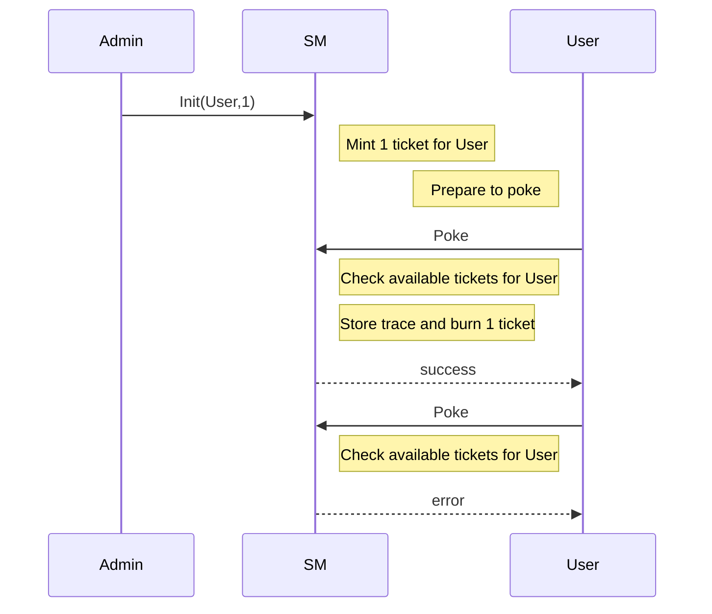

Training dapp n°3
===

# :point_up:  Poke game with permissions

Previously, you learned how to do inter-contract calls, use view and do unit testing.
In this third session, you will enhance your skills on :
- using tickets
- don't mess up with `DUP` errors while manipulating tickets

On the second version of the poke game, you were able poke any contract without constraint. We will introduce now a right to poke via tickets. Ticket are a kind of object that cannot be copied and can hold some trustable information.

## new Poke sequence diagram



# :memo: Prerequisites

There is nothing more than you needed on first session : https://github.com/marigold-dev/training-dapp-1#memo-prerequisites

Get your code from the session 2 or the solution [here](https://github.com/marigold-dev/training-dapp-2/tree/main/solution)

# :ticket: Tickets

Tickets just came with Tezos Edo upgrade, they are great and often misundersood

Ticket structure :
- ticketer : (address) the creator contract address  
- value : (any) Can be any type from string to bytes. It holds whatever arbitrary values
- amount : (nat) quantity of tickets minted

Tickets features :
- Not comparable : it makes no sense because tickets from same type are all equals and can be merged into a single ticket, for different types it is not comparable
- Transferable : you can send ticket as Transaction parameter
- Storable : only on smart contract storage for the moment (Note : a new protocol release will enable it for implicit account too)
- Non dupable : you cannot copy or duplicate a ticket, it is a unique singleton object living in specific blockchain instance
- Splittable : if amount is > 2 then you can split ticket object into 2 objects
- Mergable : you can merge ticket from same ticketer and same value
- Mintable/burnable : this is the way to create and destroy tickets

Example of usage :
- AUTHN/AUTHZ token : give a ticket to a user from a allowed ticketer gives you AUTHN, add some claims on the ticket value and it gives you AUTHZ
- Simplified FA1.2/FA2 token : you can represent crypto token with tickets (mint/burn/split/join)
- Voting rights : give 1 ticket that count for 1 vote on each member
- Wrapped crypto : hold XTZ colletral agains a ticket for redeeming it
- many others ...

## Step 1 : :seedling: Mint

Minting is the action of creating ticket from void. In general, minting operations are done by administrators of smart contract or either by end user (while creating an NFT for example)

Edit the ./smartcontract/pokeGame.jsligo file and add a map of ticket ownership to the default `storage` type.
This map will keep a list of consumable ticket for each authrozized user. It will be used as a burnable right to poke here 

```javascript
export type storage = {
    pokeTraces : map<address, pokeMessage>,
    feedback : string,
    ticketOwnership : map<address,ticket<string>>  //ticket of claims
};
```

In order to fill this map, we are adding an new administration endpoint. Modify the `parameter` type, update the `main` function and add the new function `init`

A new entrypoint `Init` will add x tickets to a specific user

> Note : to simplify, we don't add security around this entrypoint, but in Production we should do it

```javascript
export type parameter =
| ["Poke"]
| ["PokeAndGetFeedback", address]
| ["Init", address, nat]
;
```

Main function will add this new entrypoint too.

Tickets are very special objects that cannot be **DUPLICATED**. During compilation to Michelson, using a variable twice, copying a structure holding tickets are generating `DUP` command. To avoid our contract to fail at runtime, Ligo will parse statically our code during compilation time to detect any DUP on tickets.

To solve most of issues, we need to segregate ticket objects from the rest of the storage, or structures containing ticket objects in order to avoid compilation errors. To do this, just destructure any object until you get tickets isolated.

Here below, `store` object is destructured to isolate `ticketOwnership` object holding our tickets. You need then to modify the function arguments to pass each field of the the storage separately

```javascript
export const main = ([action, store] : [parameter, storage]) : return_ => {
    //destructure the storage to avoid DUP
    let {pokeTraces  , feedback  , ticketOwnership } = store;
    return match (action, {
        Poke: () => poke([pokeTraces  , feedback  , ticketOwnership]) ,
        PokeAndGetFeedback: (other : address) => pokeAndGetFeedback([other,pokeTraces  , feedback  , ticketOwnership]),
        Init: (initParam : [address, nat]) => init([initParam[0], initParam[1], pokeTraces  , feedback  , ticketOwnership])
      } 
    )
};
```

Add the new `Init` function

```javascript
const init = ([a, ticketCount, pokeTraces  , feedback  , ticketOwnership] : [address, nat, map<address, pokeMessage>  , string  , map<address,ticket<string>>]) : return_ => {
    if(ticketCount == (0 as nat)){
        return [  list([]) as list<operation>,{
            feedback,
            pokeTraces,
            ticketOwnership 
            }];
    } else {
        return [  list([]) as list<operation>,{
            feedback,
            pokeTraces,
            ticketOwnership : Map.add(a,Tezos.create_ticket("can_poke", ticketCount),ticketOwnership) 
            }];
    }
};
```

Init function looks at how many ticket to create from the current caller, then it is added to the current map

Let's modify poke functions now

```javascript
const poke = ([pokeTraces  , feedback  , ticketOwnership] : [map<address, pokeMessage>  , string  , map<address,ticket<string>>]) : return_ => {
    
    //extract opt ticket from map
    const [t , tom] : [option<ticket<string>>, map<address,ticket<string>>]  = Map.get_and_update(Tezos.get_source(), None() as option<ticket<string>>,ticketOwnership);
    
    return match(t, {
        None : () => failwith("User does not have tickets => not allowed"),
        Some : (_t : ticket<string>) => [  list([]) as list<operation>,{ //let t burn
        feedback,
        pokeTraces : Map.add(Tezos.get_source(), {receiver : Tezos.get_self_address(), feedback : ""},pokeTraces),
        ticketOwnership : tom 
     }]
    });
};
```
First, we need to extract an existing optional ticket from the map. If we try to do operation directly on the map, even trying to find or get this object in the structure, a DUP command can be generated. We use the secure `get_and_update` function from Map library to extract the item from the map and avoid any copy.

> Note : more information about this function [here](https://ligolang.org/docs/reference/map-reference) 

Second step, we can look at the optional ticket, if it exists, then we burn it (i.e we do not store it somewhere on the storage anymore) and add a trace of execution, otherwise we fail with an error message

Same for `pokeAndGetFeedback` function, do same checks and type modifications as below

```javascript
// @no_mutation
const pokeAndGetFeedback = ([oracleAddress,pokeTraces  , _feedback  , ticketOwnership]:[address,map<address, pokeMessage>  , string  , map<address,ticket<string>>]) : return_ => {
  
  //extract opt ticket from map
  const [t , tom] : [option<ticket<string>>, map<address,ticket<string>>]  = Map.get_and_update(Tezos.get_source(), None() as option<ticket<string>>,ticketOwnership);
    
  //Read the feedback view
  let feedbackOpt : option<string> = Tezos.call_view("feedback", unit, oracleAddress);

  return match(t, {
        None : () => failwith("User does not have tickets => not allowed"),
        Some : (_t : ticket<string>) =>

  match( feedbackOpt , {
    Some : (feedback : string) => {
        let feedbackMessage = {receiver : oracleAddress ,feedback: feedback};
        return [  list([]) as list<operation>, { 
          feedback,
          pokeTraces : Map.add(Tezos.get_source(),feedbackMessage , pokeTraces),
          ticketOwnership : tom 
          }]; 
        }, 
    None : () => failwith("Cannot find view feedback on given oracle address")
  })});
};
```

Compile the contract to check any errors

```bash
ligo compile contract ./smartcontract/pokeGame.jsligo 
```

Check on logs that everything is fine :ok_hand:

Try to display a DUP error now :japanese_goblin:

Add this line on poke function somewhere

```typescript
  const t2 = Map.find_opt(Tezos.get_source(),ticketOwnership);  
```

Compile again 

```bash
ligo compile contract ./smartcontract/pokeGame.jsligo 
```

This time you should see the `DUP error` generated by the find function

```logs
At line 152 characters 13 to 18,
type map address (ticket string) cannot be used here because it is not duplicable. Only duplicable types can be used with the DUP instruction and as view inputs and outputs.
At line 152 characters 13 to 18,
Ticket in unauthorized position (type error).
```

Ok so remove it !!! :negative_squared_cross_mark:

## Step 2 : Test authorization poking

Update the unit tests files to see if we can still poke

Edit ./smartcontract/unitpokeGame.jsligo

```typescript
#import "./pokeGame.jsligo" "PokeGame"

export type main_fn = (parameter : PokeGame.parameter, storage : PokeGame.storage) => PokeGame.return_ ;

// reset state
const _ = Test.reset_state ( 2 as nat, list([]) as list <tez> );
const faucet = Test.nth_bootstrap_account(0);
const sender1 : address = Test.nth_bootstrap_account(1);
const _ = Test.log("Sender 1 has balance : ");
const _ = Test.log(Test.get_balance(sender1));

const _ = Test.set_baker(faucet);
const _ = Test.set_source(faucet);

//functions
export const _testPoke = ([main , s, ticketCount] : [main_fn , address, nat]) : bool => {

    //contract origination
    const [taddr, _, _] = Test.originate(main, {
        pokeTraces : Map.empty as map<address, PokeGame.pokeMessage> , 
        feedback : "kiss" , 
        ticketOwnership : Map.empty as map<address,ticket<string>>},
        0 as tez);
    const contr = Test.to_contract(taddr);
    const contrAddress = Tezos.address(contr);
    const _ = Test.log("contract deployed with values : ");
    const _ = Test.log(contr);

    const statusInit = Test.transfer_to_contract(contr, Init([sender1,ticketCount]), 0 as tez);
    const _ = Test.log(statusInit);
    const _ = Test.log("*** Check initial ticket is here ***");
    const _ = Test.log(Test.get_storage(taddr));

    Test.set_source(s);

    const status = Test.transfer_to_contract(contr, Poke() as PokeGame.parameter, 0 as tez);
    Test.log(status);

    return match(status,{
        Fail : (_tee : test_exec_error) => false,
        Success : (_n : nat) => match(Map.find_opt (s, (Test.get_storage(taddr) as PokeGame.storage).pokeTraces), {
                                Some: (pokeMessage: PokeGame.pokeMessage) => { assert_with_error(pokeMessage.feedback == "","feedback "+pokeMessage.feedback+" is not equal to expected "+"(empty)"); assert_with_error(pokeMessage.receiver == contrAddress,"receiver is not equal"); return true; } ,
                                None: () => false
       })
    });
      
  };
  
 
  //********** TESTS *************/

  const _ = Test.log("*** Run test to pass ***"); 
  const testSender1Poke = _testPoke([PokeGame.main,sender1, 1 as nat]);

  const _ = Test.log("*** Run test to fail ***"); 
  const testSender1PokeWithNoTicketsToFail = ! _testPoke([PokeGame.main,sender1, 0 as nat]) ;
```

- On line 29, we initialize the smartcontract with some tickets
- On line 40, we check if we have an error on the test (i.e user is ot allowed to poke)
- On line 53, we test with the first user using a preexisting ticket
- On line 56, we test with the same user again but with no ticket and we should have a catched error 

Run the test, and look at the logs to track execution

```bash
ligo run test ./smartcontract/unit_pokeGame.jsligo
```

First test should be fine
```logs
"*** Run test to pass ***"
"contract deployed with values : "
KT1JVH7KyY4RVWgLRdX43WJojBRzMABN8eJu(None)
Success (2674n)
"*** Check initial ticket is here ***"
{feedback = "kiss" ; pokeTraces = [] ; ticketOwnership = [tz1TDZG4vFoA2xutZMYauUnS4HVucnAGQSpZ -> (KT1JVH7KyY4RVWgLRdX43WJojBRzMABN8eJu , ("can_poke" , 1n))]}
Success (1850n)
```

Second one should fail and be catched by the negation ` ! _testPoke`
```logs
"*** Run test to fail ***"
"contract deployed with values : "
KT1RDQWZZx8b1iLTTbqbV7AMb8oZ3MTY3PHD(None)
Success (2218n)
"*** Check initial ticket is here ***"
{feedback = "kiss" ; pokeTraces = [] ; ticketOwnership = []}
Fail (Rejected (("User does not have tickets => not allowed" , KT1RDQWZZx8b1iLTTbqbV7AMb8oZ3MTY3PHD)))
```

Final report, with only `true` values as outputs

```logs
Everything at the top-level was executed.
- testSender1Poke exited with value true.
- testSender1PokeWithNoTicketsToFail exited with value true.
```

## Step 3 : Redeploy the smart contract

Let play with the CLI

```bash
ligo compile contract ./smartcontract/pokeGame.jsligo --output-file pokeGame.tz --protocol jakarta
```

Compile an initial storage (to pass later during deployment too)

```bash
ligo compile storage ./smartcontract/pokeGame.jsligo '{pokeTraces : Map.empty as map<address, pokeMessage> , feedback : "kiss" , ticketOwnership : Map.empty as map<address,ticket<string>>}' --output-file pokeGameStorage.tz  --protocol jakarta
```

Redeploy to testnet, replacing `<ACCOUNT_KEY_NAME>` with your own user alias :warning:

```bash
tezos-client originate contract mycontract transferring 0 from <ACCOUNT_KEY_NAME> running pokeGame.tz --init "$(cat pokeGameStorage.tz)" --burn-cap 1 --force
```

```logs
New contract KT1HRu51cEigmqa8jeLZkqXfL1QYHzSFAMdc originated.
```

## Step 4 : Adapt the frontend code

Copy the new contract address KT1*** to update the file dapp/src/App.tsx

```typescript
      setContracts((await contractsService.getSimilar({address:"KT1HRu51cEigmqa8jeLZkqXfL1QYHzSFAMdc" , includeStorage:true, sort:{desc:"id"}})));
```

Rerun the app, we will check that can cannot use the app anymore without tickets

```bash
cd dapp
yarn run start
```

Connect with any wallet that has enough Tez, and Poke your own contract


My Kukai wallet is giving me back the error from the smart contract


Ok, so let's authorize some :sparkler: minting on my user and try again to poke

We add a new button for minting on a specific contract, replace the full content of App.tsx as it :

```typescript
import { useState } from 'react';
import './App.css';
import ConnectButton from './ConnectWallet';
import { TezosToolkit, WalletContract } from '@taquito/taquito';
import DisconnectButton from './DisconnectWallet';
import { Contract, ContractsService } from '@dipdup/tzkt-api';

type pokeMessage = {
  receiver : string,
  feedback : string
};

function App() {
  
  const [Tezos, setTezos] = useState<TezosToolkit>(new TezosToolkit("https://jakartanet.tezos.marigold.dev"));
  const [wallet, setWallet] = useState<any>(null);
  const [userAddress, setUserAddress] = useState<string>("");
  const [userBalance, setUserBalance] = useState<number>(0);

  const [contractToPoke, setContractToPoke] = useState<string>("");
  
  //tzkt
  const contractsService = new ContractsService( {baseUrl: "https://api.jakartanet.tzkt.io" , version : "", withCredentials : false});
  const [contracts, setContracts] = useState<Array<Contract>>([]);
  
  const fetchContracts = () => {
    (async () => {
      setContracts((await contractsService.getSimilar({address:"KT1HRu51cEigmqa8jeLZkqXfL1QYHzSFAMdc" , includeStorage:true, sort:{desc:"id"}})));
    })();
  }
  
  //poke
  const poke = async (e :  React.MouseEvent<HTMLButtonElement>, contract : Contract) => {  
    e.preventDefault(); 
    let c : WalletContract = await Tezos.wallet.at(""+contract.address);
    try {
      console.log("contractToPoke",contractToPoke);
      const op = await c.methods.pokeAndGetFeedback(contractToPoke).send();
      await op.confirmation();
      alert("Tx done");
    } catch (error : any) {
      console.log(error);
      console.table(`Error: ${JSON.stringify(error, null, 2)}`);
    }
  };

    //mint
    const mint = async (e :  React.MouseEvent<HTMLButtonElement>, contract : Contract) => {  
      e.preventDefault(); 
      let c : WalletContract = await Tezos.wallet.at(""+contract.address);
      try {
        console.log("contractToPoke",contractToPoke);
        const op = await c.methods.init(userAddress,1).send();
        await op.confirmation();
        alert("Tx done");
      } catch (error : any) {
        console.log(error);
        console.table(`Error: ${JSON.stringify(error, null, 2)}`);
      }
    };
  
  
  return (
    <div className="App">
    <header className="App-header">
    
    <ConnectButton
    Tezos={Tezos}
    setWallet={setWallet}
    setUserAddress={setUserAddress}
    setUserBalance={setUserBalance}
    wallet={wallet}
    />
    
    <DisconnectButton
    wallet={wallet}
    setUserAddress={setUserAddress}
    setUserBalance={setUserBalance}
    setWallet={setWallet}
    />

    
    <div>
    I am {userAddress} with {userBalance} mutez
    </div>
    
    
    <br />
    <div>
    <button onClick={fetchContracts}>Fetch contracts</button>
    <table><thead><tr><th>address</th><th>trace "contract - feedback - user"</th><th>action</th></tr></thead><tbody>
    {contracts.map((contract) => <tr>
      <td style={{borderStyle: "dotted"}}>{contract.address}</td>
      <td style={{borderStyle: "dotted"}}>{(contract.storage !== null && contract.storage.pokeTraces !== null && Object.entries(contract.storage.pokeTraces).length > 0)?Object.keys(contract.storage.pokeTraces).map((k : string)=>contract.storage.pokeTraces[k].receiver+" "+contract.storage.pokeTraces[k].feedback+" "+k+","):""}</td>
      <td style={{borderStyle: "dotted"}}><input type="text" onChange={e=>{console.log("e",e.currentTarget.value);setContractToPoke(e.currentTarget.value)}} placeholder='enter contract address here' />
                                          <button onClick={(e) =>poke(e,contract)}>Poke</button>
                                          <button onClick={(e)=>mint(e,contract)}>Mint 1 ticket</button></td>
                              </tr>)}
    </tbody></table>
    </div>
    
    
    </header>
    </div>
    );
  }
  
  export default App;
```

> Note : change again here by your own contract address where code is `await contractsService.getSimilar({address:"KT1HRu51cEigmqa8jeLZkqXfL1QYHzSFAMdc"`

Refresh the page, now you have the Mint button

Mint a ticket on this contract


Wait for the Tx popup confirmation and then try to poke again, it should succeed now


Wait for the Tx popup confirmation and try to poke again, you should be out of tickets and it should fail


:confetti_ball: Congratulation, you know how to use tickets now and avoid DUP errors

> Takeaways : 
> - you can go further and improve the code like consuming one 1 ticket quantity at a time and manage it the right way
> - you can also implement different type of AUTHZ, not only `can poke` claim
> - You can also try to base your ticket on some duration time like JSON token can do, not using the data field as a string but as bytes and store a timestamp on it.  

# :palm_tree: Conclusion :sun_with_face:

Now, you are able to understand ticket. If you want to learn more about tickets, read this great article [here](https://www.marigold.dev/post/tickets-for-dummies)

On next training, we will learn hot to upgrade deployed contracts

[:arrow_right: NEXT](https://github.com/marigold-dev/training-dapp-4)