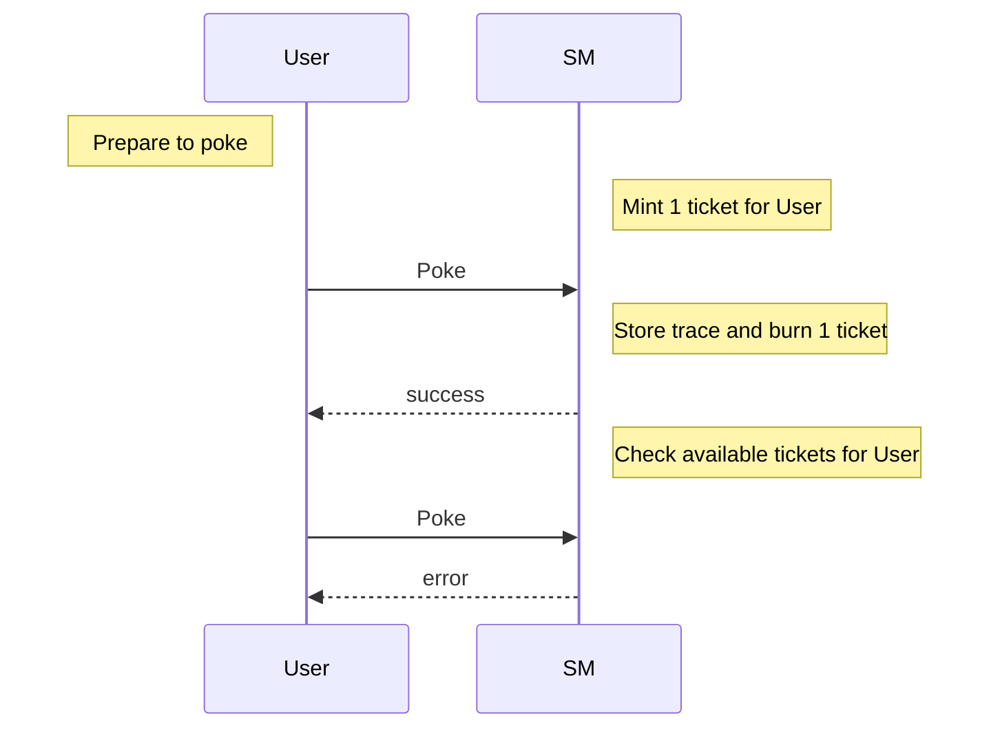

Training dapp n°3
===

# :point_up:  Poke game (reloaded)

Previouly, you learned how to do inter-contract calls, use view and do unit testing.
In this third session, you will enhance your skills on :
- using tickets
- upgrading a smart contract and store function code
- using the Global table of Constant

On the second version of the poke game, you were able poke any contract without constraint. We will introduce now a right to poke via tickets. Ticket are a kind of object that cannot be copied and can hold some trustable information.
As you maybe know, smart contracts are immutable but in real life, applications are not and evolve. Let's see 2 tricks that allow to upgrade a contract
Finally we introduce the Global table of Constant, a way to store more efficiently static data (https://www.marigold.dev/post/introducing-global-constants)

## new Poke sequence diagram

# :memo: Prerequisites

There is nothing more than you needed on first session : https://github.com/marigold-dev/training-dapp-1#memo-prerequisites

# :ticket: Tickets

## Step 1 : 

# :arrows_clockwise: Upgrades

# :minidisc: Global table of Constant

# :palm_tree: Conclusion :sun_with_face:

Now, you are able to understand ticket , upgrade deployed contracts

On next training, //TODO

[:arrow_right: NEXT](https://github.com/marigold-dev/training-dapp-4)