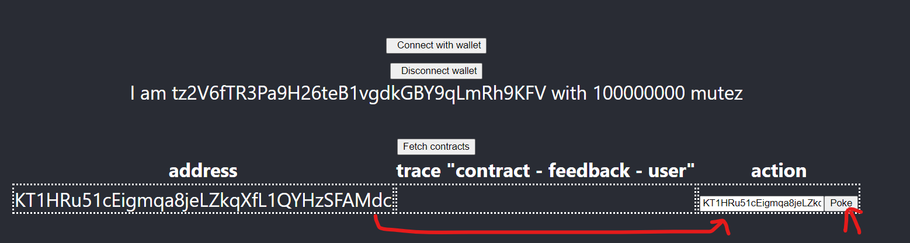
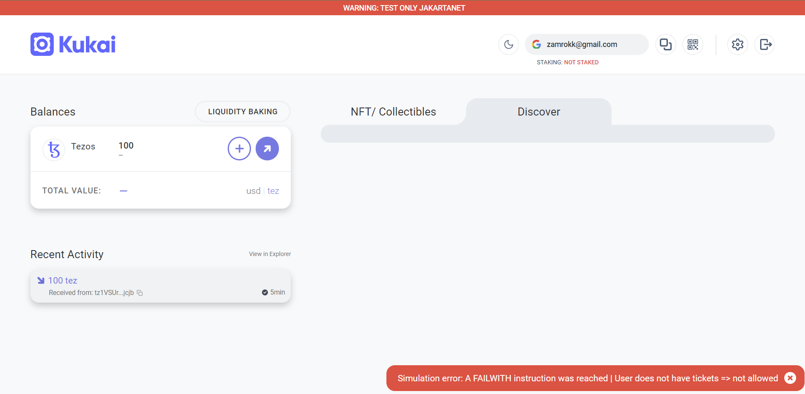
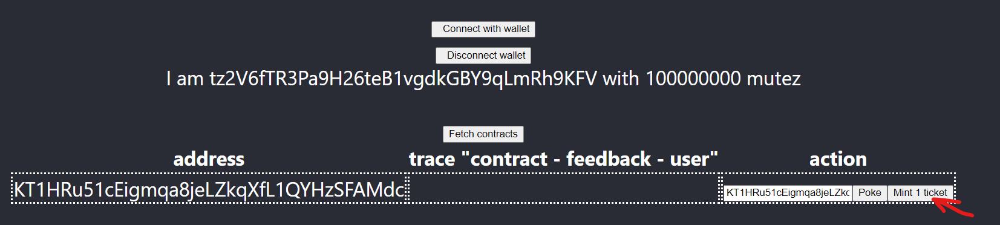
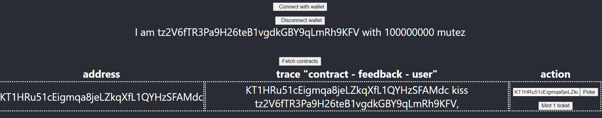

## :round_pushpin: [See Github version and full code here](https://github.com/marigold-dev/training-dapp-3)

# Training dapp n°3

# :point_up: Poke game with permissions

Previously, you learned how to do inter-contract calls, use view and do unit testing.
In this third session, you will enhance your skills on :

- using tickets
- don't mess up with `DUP` errors while manipulating tickets

On the second version of the poke game, you were able poke any contract without constraint. We will introduce now a right to poke via tickets. Ticket are a kind of object that cannot be copied and can hold some trustable information.

## new Poke sequence diagram


# :memo: Prerequisites

There is nothing more than you needed on first session : https://github.com/marigold-dev/training-dapp-1#memo-prerequisites

Get your code from the session 2 or the solution [here](https://github.com/marigold-dev/training-dapp-2/tree/main/solution)

# :ticket: Tickets

Tickets just came with Tezos Edo upgrade, they are great and often misundersood

Ticket structure :

- ticketer : (address) the creator contract address
- value : (any) Can be any type from string to bytes. It holds whatever arbitrary values
- amount : (nat) quantity of tickets minted

Tickets features :

- Not comparable : it makes no sense because tickets from same type are all equals and can be merged into a single ticket, for different types it is not comparable
- Transferable : you can send ticket as Transaction parameter
- Storable : only on smart contract storage for the moment (Note : a new protocol release will enable it for implicit account too)
- Non dupable : you cannot copy or duplicate a ticket, it is a unique singleton object living in specific blockchain instance
- Splittable : if amount is > 2 then you can split ticket object into 2 objects
- Mergable : you can merge ticket from same ticketer and same value
- Mintable/burnable : this is the way to create and destroy tickets

Example of usage :

- AUTHN/AUTHZ token : give a ticket to a user from a allowed ticketer gives you AUTHN, add some claims on the ticket value and it gives you AUTHZ
- Simplified FA1.2/FA2 token : you can represent crypto token with tickets (mint/burn/split/join)
- Voting rights : give 1 ticket that count for 1 vote on each member
- Wrapped crypto : hold XTZ colletral agains a ticket for redeeming it
- many others ...

## Step 1 : :seedling: Mint

Minting is the action of creating ticket from void. In general, minting operations are done by administrators of smart contract or either by end user (while creating an NFT for example)

Edit the `./contracts/pokeGame.jsligo` file and add a map of ticket ownership to the default `storage` type.
This map will keep a list of consumable ticket for each authrozized user. It will be used as a burnable right to poke here

```ligolang
export type storage = {
  pokeTraces: map<address, pokeMessage>,
  feedback: string,
  ticketOwnership: map<address, ticket<string>> //ticket of claims
};
```

In order to fill this map, we are adding an new administration endpoint. A new entrypoint `Init` will add x tickets to a specific user

> Note : to simplify, we don't add security around this entrypoint, but in Production we should do it

Tickets are very special objects that cannot be **DUPLICATED**. During compilation to Michelson, using a variable twice, copying a structure holding tickets are generating `DUP` command. To avoid our contract to fail at runtime, Ligo will parse statically our code during compilation time to detect any DUP on tickets.

To solve most of issues, we need to segregate ticket objects from the rest of the storage, or structures containing ticket objects in order to avoid compilation errors. To do this, just destructure any object until you get tickets isolated.

For each function having the storage as parameter, `store` object need to be destructured to isolate `ticketOwnership` object holding our tickets. then don't use anymore the `store` object or you will create a **DUP** error.

Add the new `Init` function

```ligolang
@entry
const init = ([a, ticketCount]: [address, nat], store: storage): return_ => {
  const { pokeTraces, feedback, ticketOwnership } = store;
  if (ticketCount == (0 as nat)) {
    return [
      list([]) as list<operation>,
      { pokeTraces, feedback, ticketOwnership }
    ]
  } else {
    const t: ticket<string> =
      Option.unopt(Tezos.create_ticket("can_poke", ticketCount));
    return [
      list([]) as list<operation>,
      { pokeTraces, feedback, ticketOwnership: Map.add(a, t, ticketOwnership) }
    ]
  }
};
```

Init function looks at how many tickets to create from the current caller, then it is added to the current map

Modify poke function

```ligolang
@entry
const poke = (_: unit, store: storage): return_ => {
  const { pokeTraces, feedback, ticketOwnership } = store;
  const [t, tom]: [option<ticket<string>>, map<address, ticket<string>>] =
    Map.get_and_update(
      Tezos.get_source(),
      None() as option<ticket<string>>,
      ticketOwnership
    );
  return match(t) {
    when (None):
      failwith("User does not have tickets => not allowed")
    when (Some(_t)):
      [
        list([]) as list<operation>,
        {
          feedback,
          pokeTraces: Map.add(
            Tezos.get_source(),
            { receiver: Tezos.get_self_address(), feedback: "" },
            pokeTraces
          ),
          ticketOwnership: tom
        }
      ]
  }
};
```

First, we need to extract an existing optional ticket from the map. If we try to do operation directly on the map, even trying to find or get this object in the structure, a DUP command can be generated. We use the secure `get_and_update` function from Map library to extract the item from the map and avoid any copy.

> Note : more information about this function [here](https://ligolang.org/docs/reference/map-reference)

Second step, we can look at the optional ticket, if it exists, then we burn it (i.e we do not store it somewhere on the storage anymore) and add a trace of execution, otherwise we fail with an error message

Same for `pokeAndGetFeedback` function, do same checks and type modifications as below

```ligolang
@no_mutation
@entry
const pokeAndGetFeedback = (oracleAddress: address, store: storage): return_ => {
  const { pokeTraces, feedback, ticketOwnership } = store;
  ignore(feedback);
  const [t, tom]: [option<ticket<string>>, map<address, ticket<string>>] =
    Map.get_and_update(
      Tezos.get_source(),
      None() as option<ticket<string>>,
      ticketOwnership
    );
  let feedbackOpt: option<string> =
    Tezos.call_view("feedback", unit, oracleAddress);
  return match(t) {
    when (None):
      failwith("User does not have tickets => not allowed")
    when (Some(_t)):
      match(feedbackOpt) {
        when (Some(feedback)):
          do {
            let feedbackMessage = {
              receiver: oracleAddress,
              feedback: feedback
            };
            return [
              list([]) as list<operation>,
              {
                feedback,
                pokeTraces: Map.add(
                  Tezos.get_source(),
                  feedbackMessage,
                  pokeTraces
                ),
                ticketOwnership: tom
              }
            ]
          }
        when (None):
          failwith("Cannot find view feedback on given oracle address")
      }
  }
};
```

Update the storage initialization on `pokeGame.storages.jsligo`

```ligolang
#import "pokeGame.jsligo" "Contract"

const default_storage = {
    pokeTraces: Map.empty as map<address, Contract.pokeMessage>,
    feedback: "kiss",
    ticketOwnership: Map.empty as
        map<
            address,
            ticket<string>
        > //ticket of claims

};
```

Compile the contract to check any errors

> Note : don't forget to check that Docker is running for taqueria

```bash
npm i

TAQ_LIGO_IMAGE=ligolang/ligo:1.0.0 taq compile pokeGame.jsligo
```

Check on logs that everything is fine :ok_hand:

Try to display a DUP error now :japanese_goblin:

Add this line on `poke function` after the first line of storage destructuration `const { pokeTraces, feedback, ticketOwnership } = store;`

```ligolang
const t2 = Map.find_opt(Tezos.get_source(), ticketOwnership);
```

Compile again

```bash
TAQ_LIGO_IMAGE=ligolang/ligo:1.0.0 taq compile pokeGame.jsligo
```

This time you should see the `DUP` warning generated by the find function

```logs
Warning: variable "ticketOwnership" cannot be used more than once.
```

Ok so remove it !!! :negative_squared_cross_mark:

## Step 2 : Test authorization poking

Update the unit tests files to see if we can still poke

Edit `./contracts/unit_pokeGame.jsligo`

```ligolang
#import "./pokeGame.jsligo" "PokeGame"

export type main_fn = module_contract<parameter_of PokeGame, PokeGame.storage>;

const _ = Test.reset_state(2 as nat, list([]) as list<tez>);

const faucet = Test.nth_bootstrap_account(0);

const sender1: address = Test.nth_bootstrap_account(1);

const _1 = Test.log("Sender 1 has balance : ");

const _2 = Test.log(Test.get_balance_of_address(sender1));

const _3 = Test.set_baker(faucet);

const _4 = Test.set_source(faucet);

const initial_storage = {
  pokeTraces: Map.empty as map<address, PokeGame.pokeMessage>,
  feedback: "kiss",
  ticketOwnership: Map.empty as map<address, ticket<string>>
};

const initial_tez = 0 as tez;

export const _testPoke = (
  taddr: typed_address<parameter_of PokeGame, PokeGame.storage>,
  s: address,
  ticketCount: nat,
  expectedResult: bool
): unit => {
  const contr = Test.to_contract(taddr);
  const contrAddress = Tezos.address(contr);
  Test.log("contract deployed with values : ");
  Test.log(contr);
  Test.set_source(s);
  const statusInit =
    Test.transfer_to_contract(contr, Init([sender1, ticketCount]), 0 as tez);
  Test.log(statusInit);
  Test.log("*** Check initial ticket is here ***");
  Test.log(Test.get_storage(taddr));
  const status: test_exec_result =
    Test.transfer_to_contract(contr, Poke(), 0 as tez);
  Test.log(status);
  const store: PokeGame.storage = Test.get_storage(taddr);
  Test.log(store);
  return match(status) {
    when (Fail(tee)):
      match(tee) {
        when (Other(msg)):
          assert_with_error(expectedResult == false, msg)
        when (Balance_too_low(_record)):
          assert_with_error(expectedResult == false, "ERROR Balance_too_low")
        when (Rejected(s)):
          assert_with_error(expectedResult == false, Test.to_string(s[0]))
      }
    when (Success(_n)):
      match(
        Map.find_opt(
          s,
          (Test.get_storage(taddr) as PokeGame.storage).pokeTraces
        )
      ) {
        when (Some(pokeMessage)):
          do {
            assert_with_error(
              pokeMessage.feedback == "",
              "feedback " + pokeMessage.feedback + " is not equal to expected "
              + "(empty)"
            );
            assert_with_error(
              pokeMessage.receiver == contrAddress,
              "receiver is not equal"
            )
          }
        when (None()):
          assert_with_error(expectedResult == false, "don't find traces")
      }
  }
};

const _5 = Test.log("*** Run test to pass ***");

const testSender1Poke =
  (
    (): unit => {
      const orig =
        Test.originate(contract_of(PokeGame), initial_storage, initial_tez);
      _testPoke(orig.addr, sender1, 1 as nat, true)
    }
  )();

const _6 = Test.log("*** Run test to fail ***");

const testSender1PokeWithNoTicketsToFail =
  (
    (): unit => {
      const orig =
        Test.originate(contract_of(PokeGame), initial_storage, initial_tez);
      _testPoke(orig.addr, sender1, 0 as nat, false)
    }
  )();
```

- On `Init([sender1, ticketCount])`, we initialize the smartcontract with some tickets
- On `Fail`, we check if we have an error on the test (i.e user is allowed to poke)
- On `testSender1Poke`, we test with the first user using a preexisting ticket
- On `testSender1PokeWithNoTicketsToFail`, we test with the same user again but with no ticket and we should have a catched error

Run the test, and look at the logs to track execution

```bash
TAQ_LIGO_IMAGE=ligolang/ligo:1.0.0 taq test unit_pokeGame.jsligo
```

First test should be fine

```logs
┌──────────────────────┬───────────────────────────────────────────────────────────────────────────────────────────────────────────────────────────────────────────────────────────────────────┐
│ Contract             │ Test Results                                                                                                                                                          │
├──────────────────────┼───────────────────────────────────────────────────────────────────────────────────────────────────────────────────────────────────────────────────────────────────────┤
│ unit_pokeGame.jsligo │ "Sender 1 has balance : "                                                                                                                                             │
│                      │ 3800000000000mutez                                                                                                                                                    │
│                      │ "*** Run test to pass ***"                                                                                                                                            │
│                      │ "contract deployed with values : "                                                                                                                                    │
│                      │ KT1HeEVF74BLi3fYCpr1tpkDGmruFBNjMATo(None)                                                                                                                            │
│                      │ Success (1858n)                                                                                                                                                       │
│                      │ "*** Check initial ticket is here ***"                                                                                                                                │
│                      │ {feedback = "kiss" ; pokeTraces = [] ; ticketOwnership = [tz1hkMbkLPkvhxyqsQoBoLPqb1mruSzZx3zy -> (KT1HeEVF74BLi3fYCpr1tpkDGmruFBNjMATo , ("can_poke" , 1n))]}        │
│                      │ Success (1024n)                                                                                                                                                       │
│                      │ {feedback = "kiss" ; pokeTraces = [tz1hkMbkLPkvhxyqsQoBoLPqb1mruSzZx3zy -> {feedback = "" ; receiver = KT1HeEVF74BLi3fYCpr1tpkDGmruFBNjMATo}] ; ticketOwnership = []} │
│                      │ "*** Run test to fail ***"                                                                                                                                            │
│                      │ "contract deployed with values : "                                                                                                                                    │
│                      │ KT1HDbqhYiKs8e3LkNAcT9T2MQgvUdxPtbV5(None)                                                                                                                            │
│                      │ Success (1399n)                                                                                                                                                       │
│                      │ "*** Check initial ticket is here ***"                                                                                                                                │
│                      │ {feedback = "kiss" ; pokeTraces = [] ; ticketOwnership = []}                                                                                                          │
│                      │ Fail (Rejected (("User does not have tickets => not allowed" , KT1HDbqhYiKs8e3LkNAcT9T2MQgvUdxPtbV5)))                                                                │
│                      │ {feedback = "kiss" ; pokeTraces = [] ; ticketOwnership = []}                                                                                                          │
│                      │ Everything at the top-level was executed.                                                                                                                             │
│                      │ - testSender1Poke exited with value ().                                                                                                                               │
│                      │ - testSender1PokeWithNoTicketsToFail exited with value ().                                                                                                            │
│                      │                                                                                                                                                                       │
│                      │ 🎉 All tests passed 🎉                                                                                                                                                │
└──────────────────────┴───────────────────────────────────────────────────────────────────────────────────────────────────────────────────────────────────────────────────────────────────────┘
```

## Step 3 : Redeploy the smart contract

Let play with the CLI to compile and deploy

```bash
TAQ_LIGO_IMAGE=ligolang/ligo:1.0.0 taq compile pokeGame.jsligo
taq generate types ./app/src
taq deploy pokeGame.tz -e testing
```

```logs
┌─────────────┬──────────────────────────────────────┬──────────┬──────────────────┬────────────────────────────────┐
│ Contract    │ Address                              │ Alias    │ Balance In Mutez │ Destination                    │
├─────────────┼──────────────────────────────────────┼──────────┼──────────────────┼────────────────────────────────┤
│ pokeGame.tz │ KT1TC1DabCTmdMXuuCxwUmyb51bn2mbeNvbW │ pokeGame │ 0                │ https://ghostnet.ecadinfra.com │
└─────────────┴──────────────────────────────────────┴──────────┴──────────────────┴────────────────────────────────┘
```

## Step 4 : Adapt the frontend code

Rerun the app, we will check that can cannot use the app anymore without tickets

```bash
cd app
yarn dev
```

Connect with any wallet that has enough Tez, and Poke your own contract



My Kukai wallet is giving me back the error from the smart contract



Ok, so let's authorize some :sparkler: minting on my user and try again to poke

We add a new button for minting on a specific contract, replace the full content of `App.tsx` with :

```typescript
import { NetworkType } from "@airgap/beacon-types";
import { BeaconWallet } from "@taquito/beacon-wallet";
import { TezosToolkit } from "@taquito/taquito";
import * as api from "@tzkt/sdk-api";
import { BigNumber } from "bignumber.js";
import { useEffect, useState } from "react";
import "./App.css";
import ConnectButton from "./ConnectWallet";
import DisconnectButton from "./DisconnectWallet";
import { PokeGameWalletType, Storage } from "./pokeGame.types";
import { address, nat } from "./type-aliases";

function App() {
  api.defaults.baseUrl = "https://api.ghostnet.tzkt.io";

  const Tezos = new TezosToolkit("https://ghostnet.tezos.marigold.dev");
  const wallet = new BeaconWallet({
    name: "Training",
    preferredNetwork: NetworkType.GHOSTNET,
  });
  Tezos.setWalletProvider(wallet);

  const [contracts, setContracts] = useState<Array<api.Contract>>([]);
  const [contractStorages, setContractStorages] = useState<
    Map<string, Storage>
  >(new Map());

  const fetchContracts = () => {
    (async () => {
      const tzktcontracts: Array<api.Contract> = await api.contractsGetSimilar(
        import.meta.env.VITE_CONTRACT_ADDRESS,
        {
          includeStorage: true,
          sort: { desc: "id" },
        }
      );
      setContracts(tzktcontracts);
      const taquitoContracts: Array<PokeGameWalletType> = await Promise.all(
        tzktcontracts.map(
          async (tzktcontract) =>
            (await Tezos.wallet.at(tzktcontract.address!)) as PokeGameWalletType
        )
      );
      const map = new Map<string, Storage>();
      for (const c of taquitoContracts) {
        const s: Storage = await c.storage();
        map.set(c.address, s);
      }
      setContractStorages(map);
    })();
  };

  useEffect(() => {
    (async () => {
      const activeAccount = await wallet.client.getActiveAccount();
      if (activeAccount) {
        setUserAddress(activeAccount.address);
        const balance = await Tezos.tz.getBalance(activeAccount.address);
        setUserBalance(balance.toNumber());
      }
    })();
  }, []);

  const [userAddress, setUserAddress] = useState<string>("");
  const [userBalance, setUserBalance] = useState<number>(0);
  const [contractToPoke, setContractToPoke] = useState<string>("");

  //poke
  const poke = async (
    e: React.MouseEvent<HTMLButtonElement, MouseEvent>,
    contract: api.Contract
  ) => {
    e.preventDefault();
    let c: PokeGameWalletType = await Tezos.wallet.at("" + contract.address);
    try {
      const op = await c.methods
        .pokeAndGetFeedback(contractToPoke as address)
        .send();
      await op.confirmation();
      alert("Tx done");
    } catch (error: any) {
      console.log(error);
      console.table(`Error: ${JSON.stringify(error, null, 2)}`);
    }
  };

  //mint
  const mint = async (
    e: React.MouseEvent<HTMLButtonElement>,
    contract: api.Contract
  ) => {
    e.preventDefault();
    let c: PokeGameWalletType = await Tezos.wallet.at("" + contract.address);
    try {
      console.log("contractToPoke", contractToPoke);
      const op = await c.methods
        .init(userAddress as address, new BigNumber(1) as nat)
        .send();
      await op.confirmation();
      alert("Tx done");
    } catch (error: any) {
      console.log(error);
      console.table(`Error: ${JSON.stringify(error, null, 2)}`);
    }
  };

  return (
    <div className="App">
      <header className="App-header">
        <ConnectButton
          Tezos={Tezos}
          setUserAddress={setUserAddress}
          setUserBalance={setUserBalance}
          wallet={wallet}
        />

        <DisconnectButton
          wallet={wallet}
          setUserAddress={setUserAddress}
          setUserBalance={setUserBalance}
        />

        <div>
          I am {userAddress} with {userBalance} mutez
        </div>
      </header>

      <br />
      <div>
        <button onClick={fetchContracts}>Fetch contracts</button>
        <table>
          <thead>
            <tr>
              <th>address</th>
              <th>trace "contract - feedback - user"</th>
              <th>action</th>
            </tr>
          </thead>
          <tbody>
            {contracts.map((contract) => (
              <tr>
                <td style={{ borderStyle: "dotted" }}>{contract.address}</td>
                <td style={{ borderStyle: "dotted" }}>
                  {contractStorages.get(contract.address!) !== undefined &&
                  contractStorages.get(contract.address!)!.pokeTraces
                    ? Array.from(
                        contractStorages
                          .get(contract.address!)!
                          .pokeTraces.entries()
                      ).map(
                        (e) =>
                          e[1].receiver + " " + e[1].feedback + " " + e[0] + ","
                      )
                    : ""}
                </td>
                <td style={{ borderStyle: "dotted" }}>
                  <input
                    type="text"
                    onChange={(e) => {
                      console.log("e", e.currentTarget.value);
                      setContractToPoke(e.currentTarget.value);
                    }}
                    placeholder="enter contract address here"
                  />
                  <button onClick={(e) => poke(e, contract)}>Poke</button>
                  <button onClick={(e) => mint(e, contract)}>
                    Mint 1 ticket
                  </button>
                </td>
              </tr>
            ))}
          </tbody>
        </table>
      </div>
    </div>
  );
}

export default App;
```

> Note : You have maybe noticed, but we use the full typed generated taquito classes for the storage access, now. It will improve maintenance in case you contract storage has changed.

Refresh the page, now you have the Mint button

Mint a ticket on this contract



Wait for the Tx popup confirmation and then try to poke again, it should succeed now



Wait for the Tx popup confirmation and try to poke again, you should be out of tickets and it should fail


:confetti_ball: Congratulation, you know how to use tickets now and avoid DUP errors

> Takeaways :
>
> - you can go further and improve the code like consuming one 1 ticket quantity at a time and manage it the right way
> - you can also implement different type of AUTHZ, not only `can poke` claim
> - You can also try to base your ticket on some duration time like JSON token can do, not using the data field as a string but as bytes and store a timestamp on it.

# :palm_tree: Conclusion :sun_with_face:

Now, you are able to understand ticket. If you want to learn more about tickets, read this great article [here](https://www.marigold.dev/post/tickets-for-dummies)

On next training, we will learn hot to upgrade deployed contracts

[:arrow_right: NEXT (HTML version)](https://marigold-dev.github.io/training-dapp-4)

[:arrow_right: NEXT (Github version)](https://github.com/marigold-dev/training-dapp-4)
